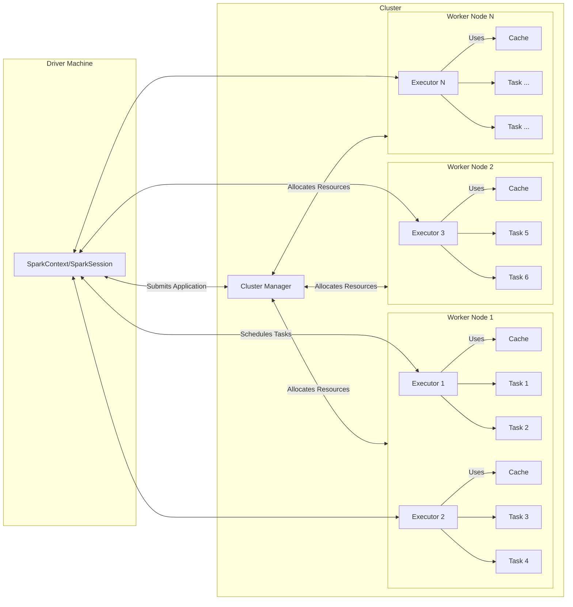

# Spark Architecture

Apache Spark is a distributed data processing framework designed for speed and ease of use. Its architecture consists of several key components:

## SparkContext
- The entry point for any Spark application.
- Manages the connection to the cluster and coordinates resources.
- Responsible for creating RDDs, accumulators and broadcast variables.
- Only one SparkContext can be active per JVM.
- You must stop() the active SparkContext before creating a new one.

## SparkSession
- Introduced in Spark 2.0 as the unified entry point for Spark applications.
- Encapsulates SparkContext, SQLContext, and HiveContext functionality.
- Used to create DataFrames, execute SQL queries, and access Spark configuration.
- Recommended for all new Spark applications.
- Only one active SparkSession is typically used per application.

## Driver Machine
- Runs the main program of the Spark application.
- Hosts the SparkContext.
- Schedules tasks and tracks their progress.
- Collects results from executors.

## Cluster Manager
- Allocates resources across applications.
- Supported cluster managers include Standalone, YARN, Mesos, Kubernetes, etc.
- Assigns worker nodes to Spark applications.

## Worker Nodes
- Physical or virtual machines in the cluster.
- Run **one or more** executors.
- Execute tasks assigned by the driver.

## Executors
- Executors are JVM processes launched on worker nodes.
- Execute tasks and store data in memory or disk.
- Communicate with the driver to report status and results.

## Tasks
- The smallest unit of work in Spark.
- Each task is a unit of computation that runs on an executor.
- A job is divided into multiple tasks that can run in parallel across the cluster.

## RDDs (Resilient Distributed Datasets)
- **Resilient:** Can recover from node failures as it keeps track of lineage.
- **Distributed:** Data is distributed across multiple nodes in the cluster.
- Immutable, distributed collections of objects.
- Can be created from Hadoop InputFormats, local files, or existing RDDs.
- Support transformations (e.g., map, filter) and actions (e.g., collect, count).

## DataFrames and Datasets
- Higher-level abstractions built on top of RDDs.
- DataFrames are distributed collections of data organized into named columns.
- Datasets provide type-safe, object-oriented programming interfaces.
- Both support a wide range of operations and optimizations.

## Spark Architecture Diagram

*Diagram: Spark Driver communicates with the Cluster Manager to allocate resources. Worker nodes run Executors, which execute tasks and store data. The Driver schedules and coordinates tasks across Executors.*

## Summary
- Spark's architecture is designed for distributed data processing, providing fault tolerance, scalability, and high performance.
- Key components include the driver, cluster manager, worker nodes, and executors.
- RDDs, DataFrames, and Datasets are the primary abstractions for working with data in Spark.