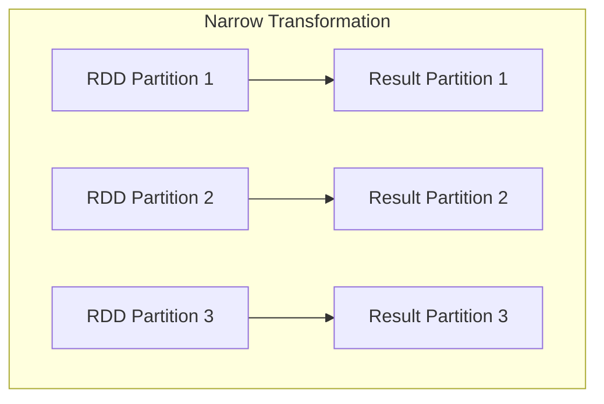
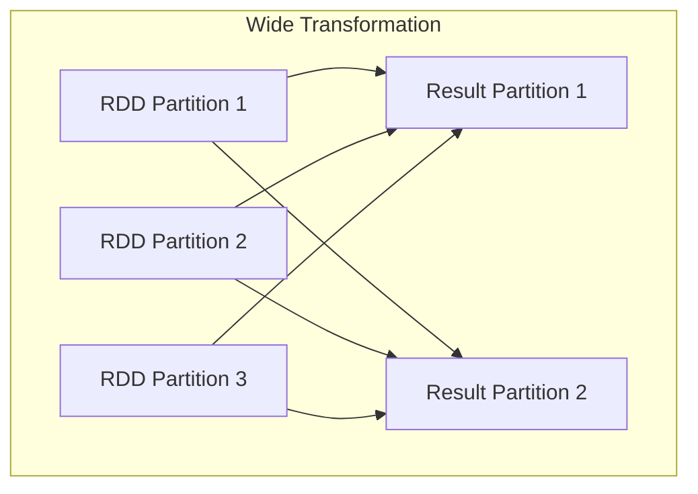
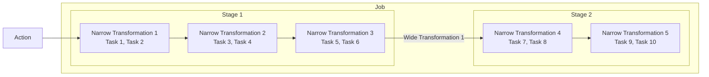

# Lazy Evaluation in Spark

- Spark uses **lazy evaluation** for transformations. 
- This means computations are not performed immediately when a transformation (like `map` or `filter`) is called. 
- Instead, Spark builds a logical plan of transformations. Actual execution happens only when an action (like `count`, `collect`, or `save`) is invoked. 
- This approach optimizes the execution plan and reduces unnecessary computations.

---

# Types of Transformations

## Narrow Transformations

- Each partition's data comes from just one partition in the parent RDD.
- No shuffling of data across the cluster.
- Examples: `map`, `filter`, `union`.

## Wide Transformations

- Data from multiple partitions may be required to compute the records in a single partition.
- Involve **shuffling**: data is exchanged between nodes.
- Examples: `groupByKey`, `reduceByKey`, `join`.

---

# Job, Stage & Task

## Job
- Triggered by an action. e.g., `count()`, `collect()`.
- Represents the complete computation required for that action.

## Stage
- A job is split into stages based on wide transformations.
- Stages are created by breaking the job at points where shuffling is required. 
- The number of stages depends on the number of wide transformations in the job.
- e.g., A job with two wide transformations will have three stages.
- Each stage contains tasks that can be executed in parallel.

## Task
- The smallest unit of work. Each task processes data from a single partition.

## Summary
- **Job** : Depends on action
- **Stage** : Depends on wide transformation
- **Task** : Depends on partitions in RDD

