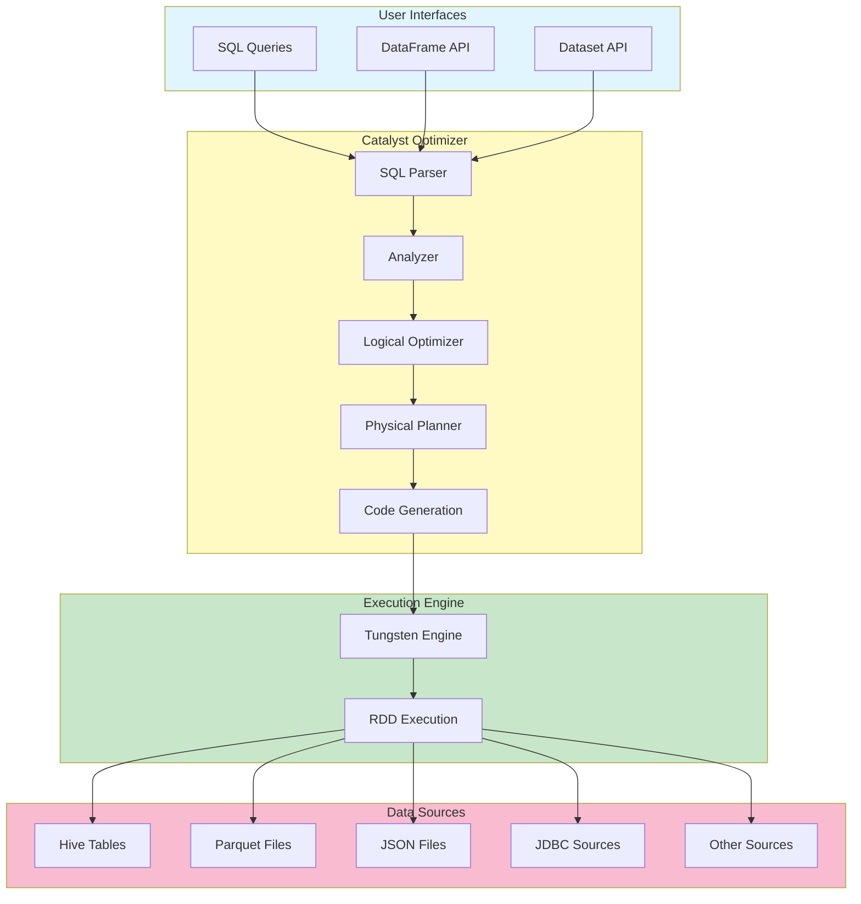

# Spark SQL Architecture

## Architecture Diagram

## Detailed Component Explanation

### 1. User Interfaces Layer

#### a) SQL Queries
- Allows users to write standard SQL queries (SELECT, JOIN, GROUP BY, etc.)
- Supports ANSI SQL compliance for compatibility
- Queries are parsed and converted to logical plans

#### b) DataFrame API
- High-level abstraction for distributed data
- Provides declarative operations (select, filter, groupBy)
- Language bindings: Scala, Java, Python, R
- Schema-aware with compile-time type safety

#### c) Dataset API
- Type-safe object-oriented interface (Scala/Java)
- Combines benefits of RDDs and DataFrames
- Compile-time type checking with Catalyst optimizations

### 2. Catalyst Optimizer

#### a) SQL Parser
- Converts SQL text or DataFrame operations into Abstract Syntax Tree (AST)
- Validates syntax and structure

#### b) Analyzer
- Resolves column names, data types, and functions
- Checks against Catalog for table/column existence
- Validates semantic correctness
- Type inference and schema validation

#### c) Logical Optimizer
- Rule-based optimization (50+ optimization rules)
- Predicate pushdown (filter early)
- Projection pruning (select only needed columns)
- Boolean expression simplification
- Join reordering and optimization

#### d) Physical Planner
- Converts logical plan to physical execution plans
- Generates multiple candidate plans
- Uses cost-based optimization (CBO)
- Considers statistics: row count, data size, cardinality
- Selects optimal join strategies (broadcast, sort-merge, shuffle hash)

#### e) Code Generation
- Generates optimized Java code at runtime
- Removes unnecessary function calls
- Reduces CPU usage
- Improves processing speed

### 3. Execution Engine

#### a) Tungsten Engine
- Better memory usage and management
- Stores data directly in memory for faster access
- Reduces data conversion overhead
- Optimizes CPU cache utilization
- Generates efficient code on-the-fly

#### b) RDD Execution
- Underlying distributed computation model
- Lazy evaluation with fault tolerance
- In-memory caching capabilities
- DAG (Directed Acyclic Graph) scheduler
- Task parallelization across cluster

## Key Features & Benefits

### 1. Unified Data Processing
- Single engine for batch and streaming
- Consistent API across data sources

### 2. Performance Optimizations
- Catalyst optimizer reduces query time by 2-10x
- Tungsten improves CPU and memory efficiency
- Adaptive Query Execution (AQE) in Spark 3.x

### 3. Scalability
- Handles petabyte-scale data
- Horizontal scaling across clusters
- Dynamic resource allocation

### 4. Ease of Use
- Familiar SQL syntax
- Rich DataFrame/Dataset APIs
- Integration with popular tools (Jupyter, Databricks, etc.)

